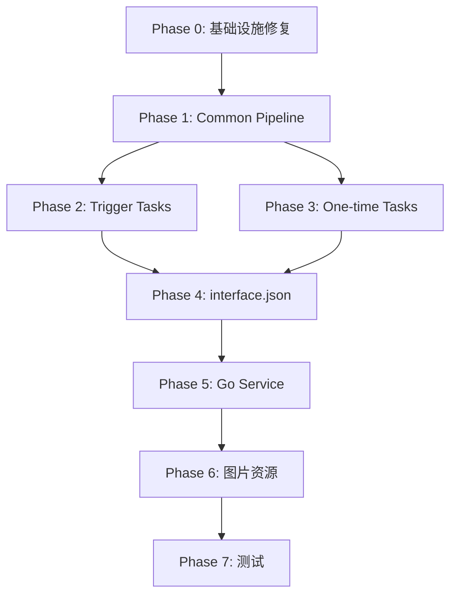

# MaaWuWaX 迁移计划

> [!WARNING]
> 本文已转为历史规划草案，包含大量已完成或已被后续实现替代的条目。
> 当前实时迁移审计请以 `docs/zh_cn/OK-WW迁移计划.md` 为准，尤其是 Combat 角色贴源状态、EchoFarm/BossTeleport、NightmareNest、Rogue、MultiAccount、FarmMap cpp-algo 接线现状。

> 将 ok-wuthering-waves 的功能迁移到 MaaFramework + MXU (macOS) 架构，
> 参照 MaaEnd 的实现模式。

## 项目对比分析

| 维度 | ok-wuthering-waves | MaaWuWaX (目标) |
|------|-------------------|-----------------|
| 框架 | ok-script (Python) | MaaFramework PI V2 |
| 平台 | Windows | macOS |
| 流程控制 | Python 代码 | Pipeline JSON + Go Service |
| 图像识别 | OpenCV/OnnxOCR/模板匹配 | MaaFramework 内置识别 + Go Custom Recognition |
| UI | PyQt-Fluent-Widgets | MXU (Tauri + React) |
| Agent | 无独立 Agent | Go Service (maa-framework-go/v4) |
| 分辨率 | 多分辨率自适应 | 基准 720p (1280×720) |

## 功能清单 (来自 ok-ww)

### Trigger Tasks (后台触发器)
1. **AutoCombatTask** - 自动战斗（角色识别、技能循环、闪避、协奏切换）
2. **AutoPickTask** - 自动拾取（黑白名单过滤）
3. **SkipDialogTask** - 跳过对话（跳过按钮、自动播放、对话箭头）
4. **AutoLoginTask** - 自动登录（检测登录界面并点击）
5. **FastTravelTask** - 快速旅行（地图传送按钮自动点击）
6. **MouseResetTask** - 鼠标重置

### One-time Tasks (一次性任务)
7. **DailyTask** - 一键日常（登录→月卡→体力消耗→日常奖励→邮件→战令）
8. **FarmEchoTask** - 刷声骸（Boss 传送→战斗→拾取→循环）
9. **TacetTask** - 无音区刷取（F2 传送→战斗→消耗体力→重复）
10. **ForgeryTask** - 凝素领域刷取（副本进入→战斗→消耗体力→重复）
11. **SimulationTask** - 模拟领域刷取（选择材料→副本→战斗→重复）
12. **NightmareNestTask** - 梦魇巢穴（噩梦净化 + 残象巢穴）
13. **AutoRogueTask** - 半自动肉鸽（周本 Rogue 模式）
14. **EnhanceEchoTask** - 批量强化声骸（词条过滤、双爆检测）
15. **ChangeEchoTask** - 批量修改声骸主属性
16. **FiveToOneTask** - 数据坞五合一（套装选择合成）

---

## Phase 0: 项目基础设施修复与增强

### 0.1 修复已知问题 (上轮审阅发现的 Bug)
- [ ] 删除旧 Python Agent（`agent/main.py`、`requirements.txt`），后续由 Go Service 替代
- [ ] 补充缺失的 `btn_teleport.png` 图片资源
- [x] `DailyRoutine.json` 的 `StaminaType` override 审计完成：当前代码中并不存在“缺少 pipeline_override”的问题，历史条目为过期误报
- [ ] 修复 StaminaType case 名称与代码不匹配的问题（改为 Go Service 后通过 Pipeline Override 实现）
- [ ] 清理未使用的 `domain` 分组或分配给实际任务
- [ ] 为 `EchoFarm` 导航添加 `timeout` / 最大重试限制

### 0.2 对齐 MaaEnd 的项目规范
- [ ] 添加 `assets/locales/` 国际化目录结构（`zh_cn.json`, `en_us.json`）
- [ ] 更新 `interface.json`：添加 `languages`, `label`, `title`, `description`, `github`, `license`, `welcome` 等字段
- [ ] 添加 `assets/resource/default_pipeline.json`（全局默认 Pipeline 配置）
- [ ] 在 `interface.json` 中为所有 task/option/group 添加 `label` 国际化引用
- [ ] 添加 `AGENTS.md` 编码规范文件（参考 MaaEnd 的编码规范，增加 Go Service 规范：Pipeline 低代码优先、Go 只写 Custom 组件、禁止在 Agent 中写业务流程）

### 0.3 完善 Pipeline 目录结构
当前结构：
```
assets/resource/pipeline/
├── AutoPick/Main.json
├── Combat/Main.json
├── Common/Buttons.json
├── Daily/Main.json
├── EchoFarm/Main.json
├── Login/Main.json
└── SkipDialog/Main.json
```

目标结构：
```
assets/resource/pipeline/
├── Common/
│   ├── Buttons.json          # 通用按钮（已有）
│   ├── SceneManager.json     # 场景检测与导航（新增）
│   ├── PopupHandler.json     # 弹窗处理（月卡、公告、确认框等）（新增）
│   └── Navigation.json       # F2 书本导航、传送等通用流程（新增）
├── Combat/
│   ├── Main.json             # 主战斗循环（已有，需重构）
│   ├── Recognition.json      # 战斗状态识别节点（新增）
│   └── CharacterRotation.json # 角色切换与技能循环（新增）
├── AutoPick/Main.json        # （已有）
├── SkipDialog/Main.json      # （已有）
├── Login/Main.json           # （已有）
├── Daily/
│   ├── Main.json             # （已有，需重构）
│   ├── Mail.json             # 邮件领取（新增）
│   ├── BattlePass.json       # 战令领取（新增）
│   └── StaminaFarm.json      # 体力消耗子流程（新增）
├── Tacet/Main.json           # 无音区刷取（新增）
├── Forgery/Main.json         # 凝素领域（新增）
├── Simulation/Main.json      # 模拟领域（新增）
├── NightmareNest/Main.json   # 梦魇巢穴（新增）
├── EchoFarm/
│   ├── Main.json             # （已有，需重构）
│   └── BossTeleport.json     # Boss 传送流程（新增）
├── Rogue/Main.json           # 半自动肉鸽（新增）
├── EchoEnhance/Main.json     # 声骸强化（新增）
├── EchoChange/Main.json      # 声骸主属性修改（新增）
├── FiveToOne/Main.json       # 数据坞五合一（新增）
└── FastTravel/Main.json      # 快速旅行（新增）
```

---

## Phase 1: 通用基础设施 (Common Pipeline + Agent)

### 1.1 SceneManager (场景管理器)
**对应 ok-ww**: `WWScene.in_team()`, `in_team_and_world()`, `in_realm()`, `in_world()`

需要实现的场景识别：
- [ ] **InTeamAndWorld** - 检测是否在队伍界面且在大世界（小地图存在 + 角色头像存在）
- [ ] **InRealm** - 检测是否在副本/领域内
- [ ] **InCombat** - 检测是否在战斗状态（有锁定目标 + 技能栏可见）
- [ ] **InDialog** - 检测是否在对话界面
- [ ] **InMenu** - 检测是否在菜单界面

**实现方式**: Pipeline JSON `TemplateMatch` 节点 + Go Custom Recognition

### 1.2 PopupHandler (弹窗处理器)
**对应 ok-ww**: `handle_monthly_card()`, `handle_claim_button()`, 各种弹窗关闭

需要处理的弹窗：
- [ ] 月卡弹窗 (`monthly_card.png` 已有)
- [ ] 确认/取消对话框（使用 `Common/Buttons.json` 已有的节点）
- [ ] 登录奖励弹窗
- [ ] 活动公告弹窗
- [ ] "本次登录不再提示" 弹窗

### 1.3 Navigation (导航系统)
**对应 ok-ww**: `openF2Book()`, `open_boss_book()`, `teleport_to_*()`, `wait_click_travel()`

需要实现的通用导航：
- [ ] **OpenF2Book** - 按 F2 打开灰书
- [ ] **SelectBookCategory** - 选择灰书分类（boss/quest/wuyin/mengyan/canxiang 等）
- [ ] **SelectBookTarget** - 在列表中点击指定目标（按索引滚动选择）
- [ ] **ClickTravelButton** - 点击传送按钮并等待加载
- [ ] **WaitInTeamAndWorld** - 等待传送完成回到大世界
- [ ] **EnsureMain** - 确保回到主界面（按 Esc + 识别确认）

### 1.4 Go Service 基础工具模块
参照 MaaEnd 的 `pkg/` 目录，在 Go Service 中实现以下通用工具：
- [ ] **`pkg/stamina`** - 体力值 OCR 识别（对应 ok-ww 的 `get_stamina()`）
- [ ] **`pkg/dailyprogress`** - 日常进度 `/180` OCR 读取
- [ ] **`pkg/keycode`** - macOS CGKeyCode 按键映射库（替代原 Python 的 KEY_CODES）
- [ ] **`pkg/walk`** - WASD 方向行走工具（KeyDown + Sleep + KeyUp）
- [ ] **`pkg/mouse`** - 鼠标控制工具（中键锁定、滚轮缩放）
- [ ] **`pkg/i18n`** - 国际化字符串加载（参考 MaaEnd 的 `pkg/i18n`）
- [ ] **`pkg/parentwatch`** - 父进程监控（MXU 崩溃时自动退出，参考 MaaEnd）
- [ ] **`pkg/pienv`** - PI V2 环境变量注入（参考 MaaEnd 的 `pkg/pienv`）

---

## Phase 2: Trigger Tasks (后台触发器)

### 2.1 AutoCombat 重构
**对应 ok-ww**: `AutoCombatTask`, `BaseCombatTask`, `CombatCheck`, 47 个角色文件

当前状态：已有基础框架，但过于简化。

**ok-ww 核心机制**:
- 角色识别（通过头像区域的模板匹配确定当前角色）
- 技能 CD 管理（OCR 读取 CD 数字，考虑冻结时间）
- 协奏值管理（检测协奏值是否充满，充满时切换角色）
- 闪避机制（检测闪避提示按键）
- 目标锁定检测
- 47 个角色各有独立的 `perform()` 技能循环

**MaaFramework 适配方案** (参照 MaaEnd `autofight` 模块):
- [ ] Pipeline: `Combat_Main` → `Combat_CheckState` → `Combat_Action` 循环
- [ ] Go Custom Recognition `CombatStateRecognition`:
  - 检测是否有锁定目标 (`has_target.png`)
  - 检测闪避提示 (`dodge_prompt.png`)
  - 检测角色是否存活
  - 参照 MaaEnd 的 `ScreenAnalyzer` 模式：每帧截图后批量分析所有状态
- [ ] Go Custom Action `CombatMainAction`:
  - 参照 MaaEnd 的 `AutoFightMainAction`，实现状态机循环
  - 从 Pipeline `attach` 字段解析战斗参数（按键映射、开关等）
  - 使用 `ctx.RunAction` 调用 Pipeline 中定义好的按键节点
  - 通过 `keymapOverrides` 动态覆盖按键配置
  - 增加协奏值检测与角色切换
  - 增加 Liberation（R 键）检测与释放
- [ ] Go Custom Recognition `CharacterDetect`:
  - 识别当前角色（使用 `char_*.png` 模板，已有大量图片资源）
  - 确定应执行的技能序列

**分步实现**:
- [ ] 2.1.1 基础战斗循环重构（状态机模式：扫描→接敌→输出→闪避→拾取）
- [ ] 2.1.2 角色识别节点（利用已有的 `char_*.png` 资源）
- [ ] 2.1.3 协奏值检测（使用 `con_full_*.png` 检测充满状态）
- [ ] 2.1.4 技能 CD OCR 读取
- [ ] 2.1.5 Liberation / Echo 技能释放逻辑
- [ ] 2.1.6 死亡检测与复活处理

### 2.2 AutoPick 增强
**对应 ok-ww**: `AutoPickTask`

当前状态：已有基础框架，基本可用。

需要增强：
- [ ] 添加白色检测（F 图标白色时才拾取，避免误触）
- [ ] 完善黑白名单逻辑（3 个省略号对话框检测 + 文字过滤）
- [ ] 连续按 F 多次拾取

### 2.3 SkipDialog 增强
**对应 ok-ww**: `SkipDialogTask`, `SkipBaseTask`

当前状态：已有基础框架。

需要增强：
- [ ] 添加对话气泡点击（`message` + `message_dialog` 检测后点击）
- [ ] 增加多语言支持（中/英跳过按钮识别）
- [ ] 不在队伍中时才跳过（避免战斗中误触）

### 2.4 AutoLogin 增强
**对应 ok-ww**: `AutoLoginTask`

当前状态：已有基础框架，使用 OCR 循环检测登录界面。

需要增强：
- [ ] 增加更多登录界面文本匹配（支持中英日等多语言）
- [ ] 增加账号选择界面处理
- [ ] 增加服务器选择处理

### 2.5 FastTravel 新增
**对应 ok-ww**: `FastTravelTask`

- [ ] 新增 Pipeline `FastTravel_Main`
- [ ] 检测地图传送图标 (`gray_teleport.png` 已有)
- [ ] OCR 检测 "快速旅行"/"Travel"/"前往"/"Proceed" 文本
- [ ] 自动点击传送按钮

### 2.6 MouseReset 新增
**对应 ok-ww**: `MouseResetTask`

- [ ] 检测鼠标位置异常时重置到屏幕中心

---

## Phase 3: One-time Tasks (一次性任务)

### 3.1 DailyRoutine 重构
**对应 ok-ww**: `DailyTask`

当前状态：已有 `Daily_Main` pipeline，但流程不完整。

**ok-ww 完整流程**:
1. 确保在主界面 (`ensure_main`)
2. 打开 F2 灰书 → 任务页面 → 读取日常进度 `/180`
3. 根据进度决定是否消耗体力（选择无音区/凝素/模拟）
4. 领取日常奖励（点击 100 活跃度宝箱）
5. 领取邮件
6. 领取战令

需要实现：
- [ ] 3.1.1 完善日常进度检测 Pipeline
- [ ] 3.1.2 日常奖励领取节点（检测 `boss_proceed` + 点击 100 活跃宝箱）
- [ ] 3.1.3 邮件领取子流程（`Daily_MailClick` 需要实际导航到邮件页面）
- [ ] 3.1.4 战令领取子流程（Alt+快捷方式 → 领取）
- [ ] 3.1.5 月卡检测与处理（在 DailyTask 开头加入月卡检查）

### 3.2 TacetTask 新增
**对应 ok-ww**: `TacetTask`

- [ ] 新增 Pipeline `Tacet/Main.json`
- [ ] F2 → 灰书 boss → 无音分类 → 选择第 N 个 → 传送
- [ ] 传送后走到战斗区域（不同关卡有不同的行走路线 `door_walk_method`）
- [ ] 战斗 → 拾取 → 消耗体力 → 重复
- [ ] 体力不足时退出
- [ ] Task JSON: 选项包括 "Which Tacet Suppression to Farm" (1-17)

### 3.3 ForgeryTask 新增
**对应 ok-ww**: `ForgeryTask`

- [ ] 新增 Pipeline `Forgery/Main.json`
- [ ] F2 → 灰书 boss → 凝素分类 → 选择第 N 个 → 传送
- [ ] 进入领域（走到 F → 按 F → 点击挑战按钮）
- [ ] 副本内战斗 → 宝箱 → 消耗体力 → 再次挑战
- [ ] Task JSON: 选项包括 "Which Forgery Challenge to Farm" (1-15)

### 3.4 SimulationTask 新增
**对应 ok-ww**: `SimulationTask`

- [ ] 新增 Pipeline `Simulation/Main.json`
- [ ] F2 → 灰书 boss → 模拟分类 → 选择材料类型 → 传送
- [ ] 进入领域 → 战斗 → 消耗体力 → 重复
- [ ] Task JSON: 选项包括 "Material Selection" (Resonator EXP / Weapon EXP / Shell Credit)

### 3.5 NightmareNestTask 新增
**对应 ok-ww**: `NightmareNestTask`

- [ ] 新增 Pipeline `NightmareNest/Main.json`
- [ ] F2 → 灰书 → 梦魇/残象分类 → 检测未完成巢穴（OCR `X/Y` 进度）
- [ ] 传送 → 战斗 → 拾取声骸 → 检测是否完成
- [ ] Task JSON: 选项包括 "Which to Farm" (Nightmare Purification / Tacet Discord Nest)

### 3.6 FarmEchoTask 新增
**对应 ok-ww**: `FarmEchoTask`

这是最复杂的任务之一，ok-ww 中有 675 行代码。

- [ ] 新增 Pipeline `EchoFarm/Main.json` (重构现有) + `EchoFarm/BossTeleport.json`
- [ ] Boss 传送系统：
  - F2 → 周本/挑战选择 → 选择 Boss → 传送
  - 支持 "Weekly Challenge" 和 "Boss Challenge" 两种模式
- [ ] 战斗循环：
  - 检测是否在战斗中 → 执行战斗 → 检测战斗结束
  - 支持 Combat Wait Time 配置
  - 支持 Liberation 开关
- [ ] 声骸拾取：
  - 三种方式：Yolo / Run in Circle / Walk
  - `echo_orb.png` 模板匹配 + 自动走向拾取
- [ ] 循环控制：
  - Repeat Farm Count 配置
  - 死亡复活处理
  - 宝藏图标导航

### 3.7 AutoRogueTask 新增 (低优先级)
**对应 ok-ww**: `AutoRogueTask`

- [ ] 新增 Pipeline `Rogue/Main.json`
- [ ] 周本入口检测 → 继续上次探索 → 战斗 → 选隐喻/Buff
- [ ] 隐喻筛选（黑名单/白名单）
- [ ] 交易界面跳过
- [ ] 门/传送检测与导航
- [ ] 挑战结束检测

### 3.8 EnhanceEchoTask 新增 (中优先级)
**对应 ok-ww**: `EnhanceEchoTask`

- [ ] 新增 Pipeline `EchoEnhance/Main.json`
- [ ] 需要大量 OCR 识别（属性名 + 数值）
- [ ] Go Custom Action: 词条评估逻辑
  - 双爆检测（暴击 + 暴击伤害）
  - 有效词条计数
  - 首条词条检查
- [ ] 强化成功：上锁 + 截图
- [ ] 强化失败：弃置
- [ ] Task JSON: 丰富的配置选项（双爆阈值、有效词条列表等）

### 3.9 ChangeEchoTask 新增 (低优先级)
**对应 ok-ww**: `ChangeEchoTask`

- [ ] 新增 Pipeline `EchoChange/Main.json`
- [ ] 仅支持中文游戏语言
- [ ] OCR 识别当前主属性 → 选择目标属性 → 确认修改

### 3.10 FiveToOneTask 新增 (低优先级)
**对应 ok-ww**: `FiveToOneTask`

- [ ] 新增 Pipeline `FiveToOne/Main.json`
- [ ] 数据坞 → 批量融合界面
- [ ] 套装选择 → 属性过滤 → 全选 → 合成
- [ ] Task JSON: 每个套装的多选属性配置

---

## Phase 4: interface.json 与 Task 定义

### 4.1 更新 Group 定义
```json
{
    "group": [
        {"name": "trigger", "label": "$group.trigger.label", "default_expand": true},
        {"name": "daily", "label": "$group.daily.label", "default_expand": true},
        {"name": "farm", "label": "$group.farm.label", "default_expand": true},
        {"name": "domain", "label": "$group.domain.label", "default_expand": true},
        {"name": "echo", "label": "$group.echo.label", "default_expand": true},
        {"name": "other", "label": "$group.other.label", "default_expand": true}
    ]
}
```

### 4.2 新增 Task JSON 文件
在 `assets/tasks/` 目录下新增：

| 文件名 | 对应 ok-ww 任务 | Group |
|--------|----------------|-------|
| `Tacet.json` | TacetTask | domain |
| `Forgery.json` | ForgeryTask | domain |
| `Simulation.json` | SimulationTask | domain |
| `NightmareNest.json` | NightmareNestTask | daily |
| `FarmBoss.json` | FarmEchoTask | farm |
| `AutoRogue.json` | AutoRogueTask | farm |
| `EnhanceEcho.json` | EnhanceEchoTask | echo |
| `ChangeEcho.json` | ChangeEchoTask | echo |
| `FiveToOne.json` | FiveToOneTask | echo |
| `FastTravel.json` | FastTravelTask | trigger |

### 4.3 更新 interface.json agent 配置
```json
{
    "agent": [
        {
            "child_exec": "agent/go-service",
            "child_args": []
        }
    ]
}
```
> **注意**: `child_exec` 指向编译好的 Go 二进制文件路径。
> MXU 会以此路径启动 Go Service 子进程，通过 AgentServer 协议通信。

### 4.4 更新 interface.json import 列表
```json
{
    "import": [
        "tasks/AutoCombat.json",
        "tasks/AutoPick.json",
        "tasks/SkipDialog.json",
        "tasks/AutoLogin.json",
        "tasks/FastTravel.json",
        "tasks/DailyRoutine.json",
        "tasks/NightmareNest.json",
        "tasks/Tacet.json",
        "tasks/Forgery.json",
        "tasks/Simulation.json",
        "tasks/FarmBoss.json",
        "tasks/AutoRogue.json",
        "tasks/EnhanceEcho.json",
        "tasks/ChangeEcho.json",
        "tasks/FiveToOne.json",
        "tasks/EchoFarm.json"
    ]
}
```

---

## Phase 5: Go Service 搭建

> **核心决策**: 使用 Go Service 替代原有 Python Agent。
> 参照 MaaEnd 的 `agent/go-service/` 架构，从零搭建 MaaWuWaX 的 Go Service。

### 5.0 项目初始化
- [ ] 删除旧 Python Agent（`agent/main.py`）
- [ ] 创建 `agent/go-service/` 目录
- [ ] 初始化 `go.mod`：
  ```
  module github.com/MaaWuWaX/MaaWuWaX/agent/go-service
  go 1.25+
  require github.com/MaaXYZ/maa-framework-go/v4 v4.0.0-beta.17+
  require github.com/rs/zerolog
  require github.com/bytedance/sonic
  ```
- [ ] 创建入口文件 `main.go`（参照 MaaEnd：initLogger → parentwatch → pienv → i18n → maa.Init → registerAll → AgentServerStartUp）
- [ ] 创建 `register.go`（统一注册所有 Custom Recognition/Action/Sink）
- [ ] 创建 `logger.go`（日志初始化，输出到 `debug/` 目录）
- [ ] 创建 `version.go`（版本常量）
- [ ] 创建 `stderr_darwin.go`（stderr 重定向，macOS 版）
- [ ] 创建 `.gitignore`（忽略编译产物）

### 5.1 项目目录结构
```
agent/go-service/
├── main.go                 # 入口（maa.Init → registerAll → AgentServerStartUp）
├── register.go             # 统一注册所有组件
├── logger.go               # 日志初始化
├── version.go              # 版本常量
├── stderr_darwin.go        # macOS stderr 重定向
├── go.mod
├── go.sum
├── .gitignore
├── pkg/                    # 通用工具包
│   ├── i18n/               # 国际化
│   ├── parentwatch/        # 父进程监控
│   ├── pienv/              # PI V2 环境变量
│   ├── keycode/            # macOS CGKeyCode 按键映射
│   ├── walk/               # WASD 方向行走
│   ├── mouse/              # 鼠标控制
│   └── maafocus/           # MaaFocus 打印工具
├── common/                 # 通用 Custom 组件
│   ├── subtask/            # SubTask 支持
│   ├── pipelineoverride/   # Pipeline Override
│   └── falseaction/        # 假动作（用于条件判断）
├── combat/                 # 自动战斗模块（最核心）
│   ├── combat.go           # CombatMainAction（状态机循环）
│   ├── screenanalyzer.go   # 屏幕分析器（批量识别所有状态）
│   ├── register.go         # 注册入口
│   └── keycode.go          # 战斗专用键码映射
├── pickup/                 # 自动拾取模块
│   ├── pickup.go           # PickFilterRecognition
│   └── register.go
├── dialogskip/             # 对话跳过模块
│   ├── dialogskip.go
│   └── register.go
├── login/                  # 自动登录模块
│   ├── login.go
│   └── register.go
├── daily/                  # 日常任务模块
│   ├── daily.go            # DailyRoutineAction
│   ├── mail.go             # ClaimMailAction
│   ├── battlepass.go       # ClaimBattlePassAction
│   └── register.go
├── stamina/                # 体力消耗模块
│   ├── stamina.go          # SpendStaminaAction + StaminaReader
│   └── register.go
├── echofarm/               # 声骸刷取模块
│   ├── echofarm.go         # BossNavigator + TeleportBossAction
│   └── register.go
├── echonhance/             # 声骸强化模块
│   ├── enhance.go          # EchoEvaluator + EchoEnhanceAction
│   └── register.go
├── navigation/             # 通用导航模块
│   ├── navigate.go         # MinimapNavigateRecognition
│   └── register.go
└── taskersink/             # Tasker Sink
    └── processcheck/       # 进程检测
```

### 5.2 新增 Go Custom Recognition

| 包名 | 类型 | 用途 | 对应 ok-ww |
|------|------|------|-----------|
| `combat/` | `CombatStateRecognition` | 战斗状态识别（目标锁定、闪避、存活检测） | `CombatCheck` |
| `combat/` | `CharacterDetect` | 当前角色识别（`char_*.png` 模板匹配） | `get_current_char()` |
| `combat/` | `ConcertFullDetect` | 协奏值检测（`con_full_*.png`） | `is_con_full()` |
| `pickup/` | `PickTextFilterRecognition` | 拾取文字黑白名单过滤 | `AutoPickTask` |
| `login/` | `LoginScreenDetect` | 登录界面检测 | `AutoLoginTask` |
| `navigation/` | `MinimapNavigateRecognition` | 小地图导航 | `FarmEchoTask` |
| `daily/` | `DailyProgressReader` | OCR 读取日常进度 `/180` | `open_daily()` |
| `daily/` | `IsMailEnabledRecognition` | 邮件是否可用检测 | `DailyTask` |
| `stamina/` | `StaminaReader` | OCR 读取当前体力值 | `get_stamina()` |
| `echofarm/` | `EchoOrbDetect` | 声骸球体检测 | `echo_orb.png` |
| `echonhance/` | `EchoStatReader` | OCR 读取声骸属性词条 | `check_echo_stats()` |

### 5.3 新增 Go Custom Action

| 包名 | 类型 | 用途 | 对应 ok-ww |
|------|------|------|-----------|
| `combat/` | `CombatMainAction` | 战斗主循环状态机（参照 MaaEnd `AutoFightMainAction`） | `combat_once()`, `perform()` |
| `pickup/` | `PickEnhancedAction` | 增强拾取（多次按F + 白色检测） | `AutoPickTask` |
| `daily/` | `DailyRoutineAction` | 日常任务主编排 | `DailyTask` |
| `daily/` | `ClaimMailAction` | 邮件领取 | `DailyTask.claim_mail` |
| `daily/` | `ClaimBattlePassAction` | 战令领取 | `DailyTask.claim_battle_pass` |
| `stamina/` | `SpendStaminaAction` | 体力消耗确认与继续 | `use_stamina()` |
| `echofarm/` | `TeleportBossAction` | Boss 传送与导航 | `teleport_to_configured_boss()` |
| `echonhance/` | `EchoEnhanceAction` | 声骸强化（词条评估+上锁/弃置） | `EnhanceEchoTask` |
| `common/` | `DirectionWalkAction` | WASD 方向行走指定时间 | `run_until()` |

### 5.4 核心设计模式（参照 MaaEnd）

#### attach + JSON Override 模式
```go
// Pipeline JSON 中定义 attach 参数
// "attach": { "enable_dodge": true, "combo_keymap": "E", ... }

// Go 中解析
type combatAttach struct {
    EnableDodge  bool   `json:"enable_dodge"`
    ComboKeymap  string `json:"combo_keymap"`
    // ...
}

// 动态生成 Pipeline Override
override := fmt.Sprintf(`{"__CombatActionCombo":{"key":%d}}`, keyCode)
ctx.RunAction("__CombatActionCombo", roi, "", override)
```

#### ScreenAnalyzer 模式（战斗专用）
```go
// 每帧截图一次，批量分析所有状态
type ScreenAnalyzer struct {
    hasTarget    bool
    hasDodge     bool
    charAlive    []int
    comboFull    []int
    energyLevel  int
    // ...
}

func (sa *ScreenAnalyzer) Update(ctx *maa.Context, img image.Image) bool {
    // 一次性跑完所有识别，更新内部状态
}
```

#### Register 模式
```go
// 每个模块都有 register.go
func Register() {
    maa.RegisterCustomRecognition("CombatState", &CombatStateRecognition{})
    maa.RegisterCustomAction("CombatMain", &CombatMainAction{})
}

// 在 register.go 统一调用
func registerAll() {
    combat.Register()
    pickup.Register()
    daily.Register()
    // ...
}
```

---

## Phase 6: 图片资源管理

> **素材来源**: MaaWuWaX 的 256 张模板图片均从 ok-wuthering-waves 提取裁切，
> 完全覆盖 ok-ww COCO 注解中的 242 个模板名称，且额外多出 14 张。当前素材完全够用。

### 6.1 已知缺失的图片
- [ ] `btn_teleport.png` — Pipeline `SpendStamina` 和 Go Service 中引用，需从游戏截图裁切

### 6.2 补充策略（按需执行）
1. **优先使用现有 256 张模板** — 直接用于 MaaFramework TemplateMatch
2. **UI 解包资源作参考** — `/Volumes/SDXC/Documents/WutheringWaves-UIResources/` 有 12,264 张 PNG，
   但原始 UI 纹理与实际渲染存在差异，不能直接用于 TemplateMatch，仅作为裁切参考
3. **从 ok-ww COCO 截图中按需裁切** — 如果需要新模板，从 41 张全屏截图中按 COCO bbox 裁切
4. **实际游戏截图补充** — 版本更新后 UI 变化时，需重新截图更新模板

### 6.3 需要新增的图片（根据功能扩展）
- [ ] 场景检测类：队伍界面、副本界面、菜单界面等
- [ ] F2 书本分类图标（部分已有：`gray_book_boss.png`, `gray_book_quest.png` 等）
- [ ] 声骸强化界面元素
- [ ] 肉鸽模式界面元素

---

## Phase 7: 测试与验证

### 7.1 Pipeline 验证
- [ ] 所有 Pipeline JSON 语法正确性检查
- [ ] 所有模板图片文件存在性检查
- [ ] interface.json 与所有 Task JSON 交叉引用验证
- [ ] Pipeline `next` 列表完整性检查（确保所有可能的画面都有对应节点）

### 7.2 功能验证 (需 macOS 环境)
- [ ] 每个 Trigger Task 独立运行测试
- [ ] 每个 One-time Task 独立运行测试
- [ ] 弹窗处理覆盖测试（月卡、确认框、公告等）
- [ ] 传送流程端到端测试

---

## 实施优先级

### P0 - 立即修复 (基础设施)
1. 修复 Phase 0 中所有已知 Bug
2. 删除旧 Python Agent，添加 `AGENTS.md` 与国际化基础
3. 完善 Common Pipeline 节点

### P1 - 高优先级 (核心功能)
4. Go Service 脚手架搭建 (Phase 5.0-5.1)
5. Trigger Tasks 全部实现 (Phase 2)
6. 战斗系统核心 (Phase 2.1 + combat 模块)
7. DailyRoutine 重构 (Phase 3.1)

### P2 - 中优先级 (副本刷取)
8. TacetTask (Phase 3.2)
9. ForgeryTask (Phase 3.3)
10. SimulationTask (Phase 3.4)
11. FarmEchoTask (Phase 3.6)

### P3 - 低优先级 (高级功能)
12. NightmareNestTask (Phase 3.5)
13. EnhanceEchoTask (Phase 3.8)
14. AutoRogueTask (Phase 3.7)
15. ChangeEchoTask (Phase 3.9)
16. FiveToOneTask (Phase 3.10)

---

## 关键技术决策

### 1. Go Service（而非 Python Agent）
MaaEnd 使用 Go Service 处理复杂逻辑，MaaWuWaX 原有 Python Agent 为半成品。
**决策**: 采用 **Go Service**，使用 `maa-framework-go/v4` 绑定库。理由：
- **MaaEnd 作为完整范本**：`main.go` → `register.go` → 各业务模块的组织模式可直接参考
- **性能优势**：鸣潮自动战斗是性能敏感场景（每帧 ~50ms 截图+识别），Go 比 Python 快 10-100x
- **分发简洁**：编译为单一二进制文件 `agent/go-service`，无需打包 Python 解释器和依赖
- **现有 Python Agent 需要重写**：当前 `agent/main.py` 有 5 个 Bug，且功能不完整，重写成本与修补相当

### 2. 分辨率基准
ok-ww 支持多分辨率自适应，MaaEnd 以 720p 为基准。
**决策**: 以 720p (1280×720) 为基准分辨率，所有 ROI 和模板图片均基于此分辨率。
MaaFramework 会自动缩放适配实际分辨率。

### 3. 角色技能循环
ok-ww 为 47 个角色各写了独立的 `perform()` 方法（数百行代码）。
**决策**: 初期采用简化方案（通用 Q→T→E→J 循环），后续逐步为常用角色添加
个性化技能循环。通过 Pipeline JSON 的 `attach` 字段 + Go `keymapOverrides` 传入角色配置。

### 4. 声骸强化
ok-ww 的声骸强化依赖大量 OCR + 数值解析。
**决策**: 使用 MaaFramework 内置 OCR + Go Custom Action 自定义评估逻辑。
词条评估逻辑直接从 ok-ww 的 `check_echo_stats()` 移植为 Go 代码。

### 5. Go Service 技术栈
```
核心依赖:
  github.com/MaaXYZ/maa-framework-go/v4   # MaaFramework Go 绑定
  github.com/rs/zerolog                    # 结构化日志
  github.com/bytedance/sonic               # 高性能 JSON 编解码
  golang.org/x/image                       # 图像处理
```

---

## 依赖关系图



## 工作量估算

| Phase | 预计工作量 | 说明 |
|-------|-----------|------|
| Phase 0 | 1-2 天 | Bug 修复 + 项目规范对齐 |
| Phase 1 | 2-3 天 | 场景管理、弹窗处理、导航系统 |
| Phase 2 | 3-5 天 | 6 个 Trigger Task |
| Phase 3 | 5-8 天 | 10 个 One-time Task |
| Phase 4 | 1 天 | interface.json 与 Task 定义 |
| Phase 5 | 4-6 天 | Go Service 搭建 + 全部 Custom 组件（含脚手架、pkg、战斗核心） |
| Phase 6 | 1-2 天 | 图片资源采集与整理 |
| Phase 7 | 2-3 天 | 测试与调试 |
| **总计** | **19-30 天** | 按优先级分批实施 |
